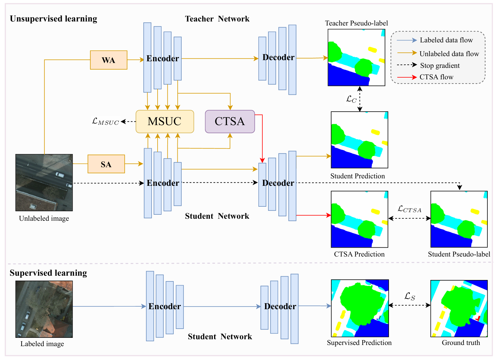
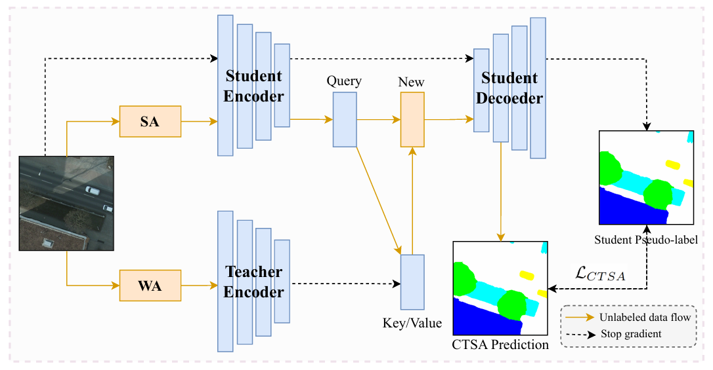

# RS-MUCA

The code implementation of the MUCA model.


<p align="center">


</p>

### Environment

---

```
python == 3.8.10
torch == 1.13.0+cu117
torchvision == 0.14.0+cu117
mmcv == 2.2.0
tensorboard == 2.13.0
pandas == 2.0.2
numpy == 1.24.3
pillow == 9.5.0
tqdm == 4.65.0
einops == 0.8.0
opencv-python == 4.10.0.84
scipy == 1.10.1
```

### Dataset

Your file structure will be like:

---

```
├── [Your Dataset Path]
    ├── JPEGImages
        ├── img_001.jpg
        ├── img_002.jpg
        └── ...
    ├── SegmentationClass
        ├── label_001.png
        ├── label_002.png
        └── ...
    └── ImageSets
    	└──Segmentation
    		└──split.txt
```
Modify your dataset path in train.py
``
Dataset_path  = 'YourDataset'
`` 
.

### Pretrained Backbone
Download the pretrained [Segformer](https://pan.baidu.com/s/1tH4wdGnACtIuGOoXb0_rAw). Code = ``tyjr``.
```
├── model_data
    └── segformer_backbone.pth
```

### Training

---

```
python3 train.py
```

### Evaluating

---
```
python3 evaluate.py
```

### Citation
If you find it useful, please consider citing:
```
@article{wang2025semi,
  title={Semi-supervised Semantic Segmentation for Remote Sensing Images via Multi-scale Uncertainty Consistency and Cross-Teacher-Student Attention},
  author={Wang, Shanwen and Sun, Xin and Chen, Changrui and Hong, Danfeng and Han, Jungong},
  journal={arXiv preprint arXiv:2501.10736},
  year={2025}
}
```

